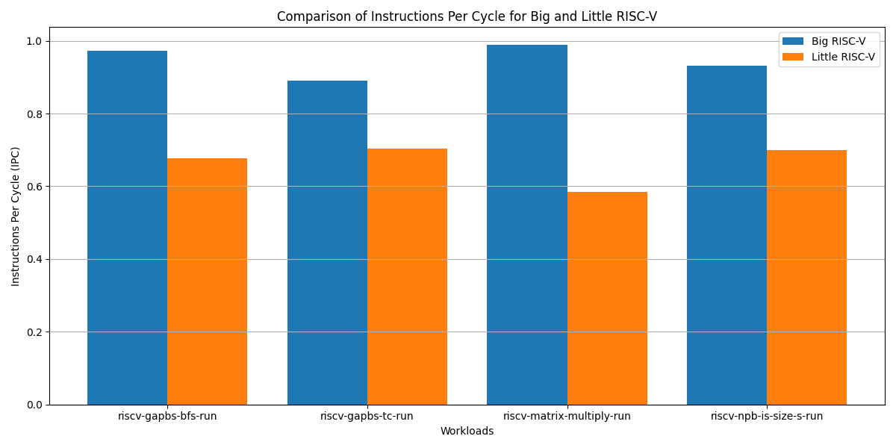
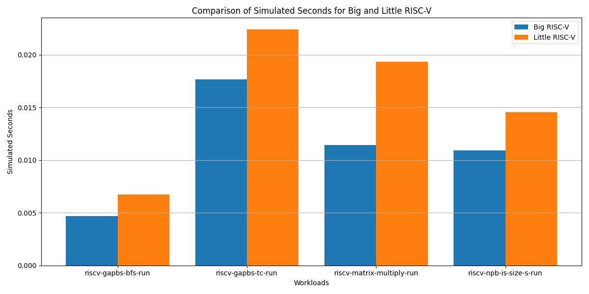
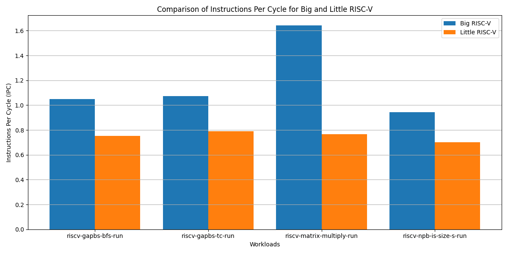
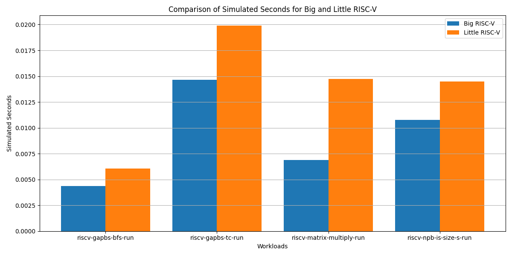
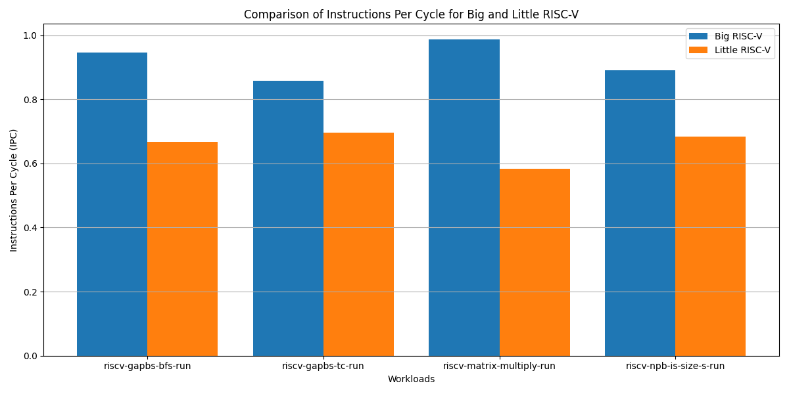
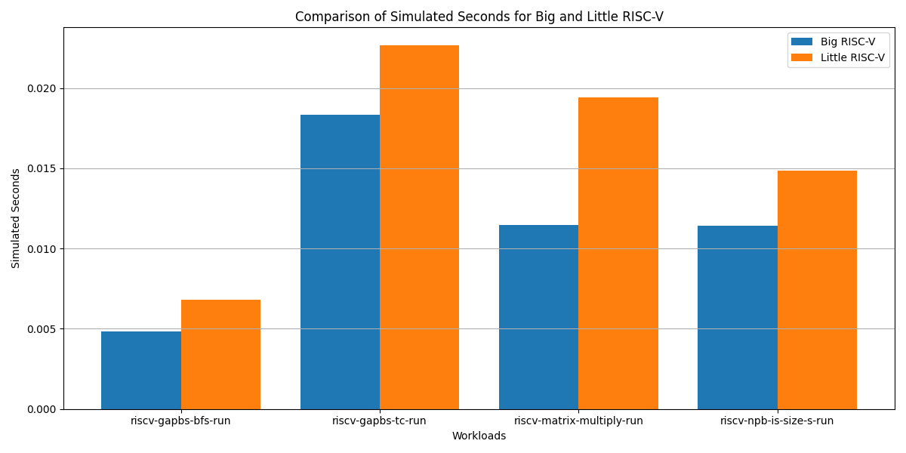

## 1 Performance Comparison:

### Compare the performance of the Big core and Little core configurations. What are the key differences in IPC and execution time? How do the two configurations perform across different workloads?

| Workload                      | Sim Seconds Difference | IPC Difference |
|-------------------------------|-----------------------|-----------------|
|riscv-gapbs-bfs-run            |       0.002053        |      0.295719   |           
|riscv-gapbs-tc-run             |       0.004712        |      0.187473   |           
|riscv-matrix-multiply-run      |       0.007907        |      0.403745   |           
|riscv-npb-is-size-s-run        |       0.003610        |      0.231474   |

The Big core configuration clearly outperforms its Little counterpart in every workload, showing lesser simulated seconds and more instructions per cycle (IPC from here on out).
The key difference in IPC is that Big's smallest IPC is 0.89 on riscv-gapbs-tc-run while Little's highest was 0.70 on that same workload. This means the smallest gap was 0.19, while the highest IPC gap was 0.40 on riscv-matrix-multiply-run (0.99 on Big vs 0.59 on Little).
The dimension of the gaps do not correlate in IPC and simulated seconds, that is to say, while the biggest gap in simulated time is also on riscv-matrix-multiply-run (0.008 seconds difference) the lowest simulated time difference was on riscv-gapbs-bfs-run (0.002 seconds difference).

However the trend in both IPC and Simulated time is constant across all workloads, with the Big core taking less time to compute and more instructions executed per cycle than the Little configuration.

### When changing the cache and memory configurations, does the performance gap between the Big and Little cores change?

| Workload                      | Sim Seconds Difference | IPC Difference |
|-------------------------------|-----------------------|-----------------|
|riscv-gapbs-bfs-run            |       0.001707        |      0.295330   |           
|riscv-gapbs-tc-run             |       0.005230        |      0.282696   |           
|riscv-matrix-multiply-run      |       0.007841        |      0.873607   |           
|riscv-npb-is-size-s-run        |       0.003690        |      0.240471   |

First we executed the same workloads with more memory on every cache level. We can appreciate a better performance on all workloads for both configurations. However, the trend did not change for most workloads as the gaps are nearly identical.
The most notable difference is in riscv-gapbs-tc-run with an increase in time simulated differece of 0.0052 (whereas it was 0.0047 with default config) and IPC 0.28 (versus 0.18). It seems in this workload the Big configuration could make more use of the cache space.
Another interesting result is the increase in IPC gap on riscv-matrix-multiply-run, which ascended to 0.87 from 0.40, however this was not reflected on the overall performance as the simulated time difference was pretty much the same.

________________________________

| Workload                      | Sim Seconds Difference | IPC Difference |
|-------------------------------|-----------------------|-----------------|
|riscv-gapbs-bfs-run            |       0.002004        |      0.277571   |           
|riscv-gapbs-tc-run             |       0.004307        |      0.163243   |           
|riscv-matrix-multiply-run      |       0.007442        |      0.403160   |           
|riscv-npb-is-size-s-run        |       0.003453        |      0.206898   |

Next, we tried reducing the available memory channels and ran the same tests. In this case, memory channel difference did not affect the performance of neither of the configurations in a signifficant way, that is to say, the gap remained nearly constant.

## 2 Cache Impact:

### How does changing the cache configuration affect performance? Discuss the trade-offs observed between your three-level cache and the alternative cache.

We tried changing the Replacement Policy in the 3-level cache to Least Recently Used to see if the nature of the workload would prove LRU to be a better replacement policy in some of them, but worse in others. However the results were a decrease in performance in every workload, for both configurations Big and Little.

## Insights and Conclusions:

### Summarize your findings. What architectural choices led to the best performance? What recommendations would you make for future designs?
